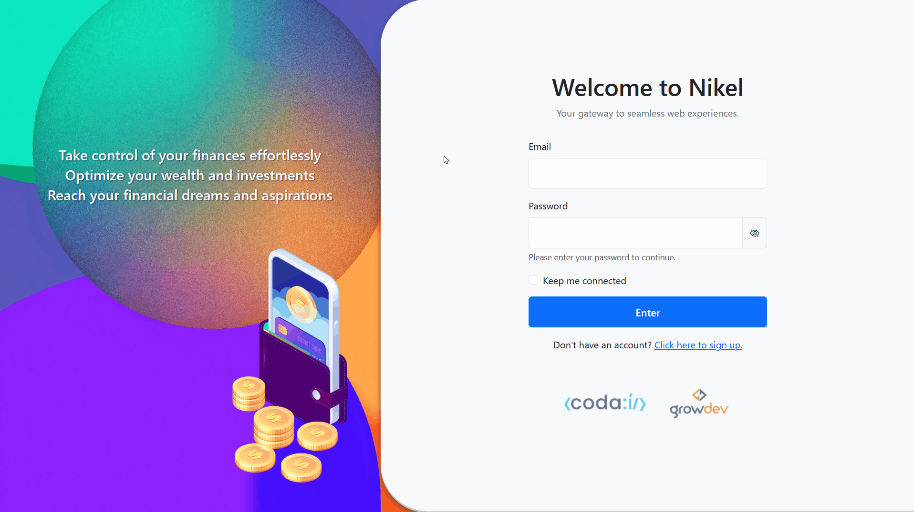

# Nikel


Nikel is a personal finance web application designed to help users organize their finances effortlessly. It allows users to track incomes and outcomes, view their current balance, and manage transactions in a simple and intuitive interface. The goal was to pass the [VesteTech]((https://growdev.com.br/vestetech/)) technical challenge by completing the challenge and finishing the free “CODAÍ 2.0” training course available on the [Growdev](https://growdev.com.br/) platform - where the project was proposed. This was my result, the public repository is a rule.

---
### 📋 Index
- [Project Overview](#-project-overview)
- [Directory Structure](#-directory-structure)
- [Highlights & Features](#-highlights--features)
- [Technologies Used](#-technologies-used)
- [Prerequisites](#-prerequisites)
- [Installation](#-installation)
- [How to Use](#-how-to-use)
- [Configuration](#-configuration)
- [Responsiveness](#-responsiveness)
- [Validation & Error Handling](#-validation--error-handling)
- [Contribution](#-contribution)
- [Future Improvements](#-future-improvements)
- [License](#-license)
- [Author](#-author)
---
## 🚀 Project Overview


Nikel was created to provide a seamless web experience for personal financial management. It addresses the common problem of disorganized finances by offering a digital pocketbook where users can log every transaction. 

**Main benefits:**
- **Simplicity:** A clean interface focused on what matters.
- **Persistence:** Uses local storage so your data remains available on the same device even after closing the browser.
- **Accessibility:** Designed to work on various device sizes, from desktops to mobile phones.

The project demonstrates core web development concepts including DOM manipulation, event handling, local storage management, and responsive design using Bootstrap.

## 📂 Directory Structure
```bash
nikel/
├── assets/
│   ├── images/
│   │   ├── coins.png      # Decorative image for login page
│   │   ├── pocket.png     # Decorative image for login page
│   │   └── [logos]        # Partner logos (Codai, Growdev)
│   └── favicon.ico        # Website browser icon
├── css/
│   └── main.css           # Custom application styles
├── js/
│   ├── home.js            # Logic for the dashboard and transaction operations
│   ├── index.js           # Logic for authentication (Login/Register)
│   └── transactions.js    # Logic for the detailed transactions list
├── index.html             # Landing page with Login and Sign Up forms
├── home.html              # Main dashboard showing balance and recent activity
├── transactions.html      # Full history of all transactions
├── LICENSE                # Project license
└── README.md              # Project documentation
```
## ✨ Highlights & Features
### 🎯 **Transaction Management**
- **Create, Read, Update, Delete (CRUD):** Users can add new incomes or outcomes, view them in a list, edit details, or remove them.
- **Financial Summary:** Automatic calculation of total balance based on incomes minus outcomes.
- **Detailed History:** A dedicated view to scroll through all past transactions sorted by date.

### 🎨 **Design/Interface**
- **Clean UI:** Utilizes a white and neutral color palette with distinct indicators for income (money) and outcome (expenses).
- **Bootstrap Framework:** Leverages Bootstrap 5 components for modals, forms, and grid layouts.
- **Intuitive Icons:** Uses Bootstrap Icons to visually represent actions and data types.

### 📱 **Compatibility/Responsiveness**
- **Mobile-First:** The layout adapts fluidly to smaller screens. The navigation bar collapses into a hamburger menu on mobile devices.
- **Flexible Tables:** Transaction lists are wrapped in responsive containers to ensure readability on all devices.

### ✅ **Validation/Security**
- **Form Validation:** Ensures emails include "@" and passwords meet minimum length requirements.
- **Password Safety:** Includes "Show/Hide" password toggles for better user experience.
- **Session Security:** Prevents access to internal pages (`home.html`, `transactions.html`) without an active session.

### 🔄 **User Experience**
- **Persistent Session:** Option to "Keep me connected" saves user credentials for quick access.
- **Instant Feedback:** Alerts notify users of successful actions (e.g., "Account created") or errors (e.g., "Passwords do not match").

## 🛠️ Technologies Used
This project was built using the following technologies:


### Technical Details:
- **HTML5**: Semantic structure of the application.
- **CSS3**: Custom styling and layout adjustments over Bootstrap.
- **JavaScript (ES6+)**: Application logic, DOM manipulation, and LocalStorage interaction.
- **Bootstrap 5.3**: Responsive grid system and UI components (Modals, Navbar).

## ⚙️ Prerequisites
To run this project locally, you only need a modern web browser. No server-side installation is required as it runs client-side.

**Requirements:**
- **Web Browser**: Chrome, Firefox, Edge, or Safari (latest versions recommended).

## 📦 Installation
```bash
# 1. Clone this repository
$ git clone https://github.com/emellybmuniz/nikel.git

# 2. Navigate to the project directory
$ cd nikel

# 3. Open the project
# Simply open the 'index.html' file in your preferred web browser.
# You can double-click the file or use a live server extension.
```
**Alternative:** Access the live version at [https://emellybmuniz.github.io/nikel/](https://emellybmuniz.github.io/Nikel/)

## 💡 How to Use
1. **Create an Account**: Open the app and click "Click here to sign up". Enter a valid email and password.
2. **Login**: Use your credentials to enter the dashboard. Check "Keep me connected" to stay logged in.
3. **Add Transaction**: Click the floating "**+**" button or "Add Transaction". Fill in value, description, date, and type (Income/Outcome).
4. **Manage Transactions**: In the dashboard, you can see recent entries. Use the "Edit" (pencil) or "Delete" (trash) buttons to manage them.
5. **View History**: Navigate to "Transactions" in the menu to see your full financial history.

### Usage Examples:
```javascript
// The application uses LocalStorage to save data formatted as:
{
  "login": "user@example.com",
  "password": "securepassword",
  "transactions": [
    {
      "id": 1715628901234,
      "value": 1500.00,
      "type": "1", // 1 for Income, 2 for Outcome
      "description": "Freelance Project",
      "date": "2024-05-13"
    }
  ]
}
```

## ⚙️ Configuration
The project runs with default configurations. Data is stored in the browser's LocalStorage.

### Basic Settings:
- **Session Persistence**: Managed via `localStorage` ("session") or `sessionStorage` ("logged").
- **Data Storage**: All user data is keyed by the user's email in `localStorage`.

## 📱 Responsiveness
The application is fully responsive and adapts to various screen sizes.

### Desktop (> 992px)
- Full navigation bar with links.
- Split view on the login page (Info + Form).
- Dashboard displays summary and table side-by-side or stacked comfortably.

### Mobile (≤ 768px)
- Navigation bar collapses into a hamburger menu.
- Login page stacks images and forms vertically.
- Transaction tables allow horizontal scrolling if content overflows.

## 🛡️ Validation & Error Handling

### Implemented Validations:
- **Email Format**: Must contain "@" and be at least 3 characters.
- **Password Length**: Minimum 4 characters required.
- **Confirm Password**: Checks if both password fields match during registration.
- **Duplicate Account**: Prevents creating multiple accounts with the same email.

### Error Handling:
- **Alerts**: Browser `alert()` functions are used to inform users of errors (e.g., "Incorrect email or password").
- **Redirects**: Unauthenticated users trying to access internal pages are redirected back to `index.html`.

## 🤝 Contribution
Contributions are always welcome and **greatly appreciated!** Feel free to open an issue or submit a pull request.

### How to contribute:
1. **Fork** this repository
2. **Clone** your fork: `git clone https://github.com/your-username/nikel.git`
3. **Create a branch** for your feature: `git checkout -b feature/amazing-feature`
4. **Make your changes** and test thoroughly
5. **Commit** your changes: `git commit -m 'Add amazing feature'`
6. **Push** to the branch: `git push origin feature/amazing-feature`
7. **Open a Pull Request** with detailed description of changes

## 🚀 Future Improvements
### Upcoming Features:
- [ ] **Data Visualization** - Add charts (Pie/Bar) to visualize expenses by category.
- [ ] **Export Data** - Feature to export transactions to CSV or PDF.
- [ ] **Dark Mode** - Toggle between light and dark themes.
- [ ] **Budget Goals** - Set monthly limits for specific categories.

### Technical Improvements:
- [ ] **Unit Testing** - Implement Jest tests for logic validation.
- [ ] **TypeScript** - Migrate codebase to TypeScript for type safety.
- [ ] **Backend Integration** - Replace LocalStorage with a REST API and database.
- [ ] **Accessibility (a11y)** - Improve ARIA labels and keyboard navigation.

## 🔑 License
This project is licensed under the **LGPL-2.1 license** - see the [LICENSE](LICENSE) file for more details.

## ✍️ Author
Crafted with ❤️ by **Emelly Beatriz**

📬 Get in touch:
📧 emellybmuniz@gmail.com |
💼 [Linkedin](https://www.linkedin.com/in/emellybmuniz) |
🐙 [Github](https://github.com/emellybmuniz)

---
⭐ **Liked the project?** Leave a star on the repository to support development!

**#Nikel #FinanceManager #Growdev #FrontEnd**
